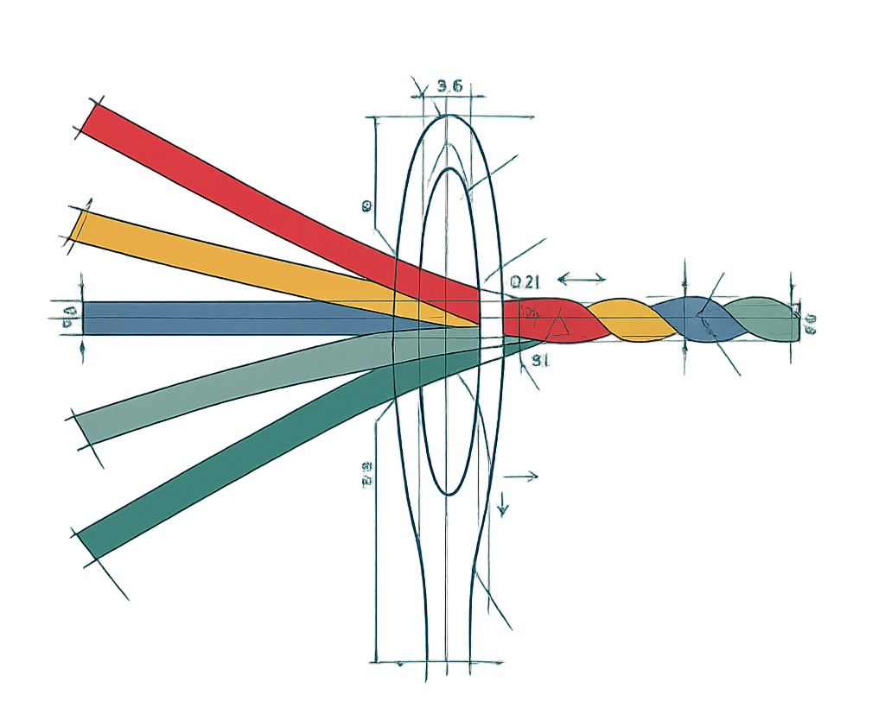

# Weavlet

Weavlet provides the building blocks of UI components, plug-and-play products, and primitive packages for building intelligent, reliable, and expressive AI experiences.

- **The Why** — AI products should be easy to build and delightful to use.
- **The How** — By transforming proven patterns into intuitive building blocks.
- **The What** — AI first UI components, plug-and-play products, and primitive packages.

## Packages

### [FactSheet](./packages/primitives/factsheet)

**Schema-driven user profile state for AI applications.**

FactSheet maintains a live, structured profile for each user by extracting facts from conversations and resolving conflicts deterministically. Instead of searching through chat history, your AI reads current truths from a single JSON object.

## Development Status

Weavlet is currently in active development (DEV). More primitives, detailed components, and full-fledged products are on the way to help define the future of AI development.

Follow **[@dpthewise](https://x.com/dpthewise)** for the latest updates and announcements.
